# CBR 2025 - Flying Robot League Autonomous Drone

This repository contains all the source code, documentation, and resources developed by **Black Bee Drones** for the **Flying Robot League (FRL)**, a category of the Brazilian Robotics Competition (CBR) 2025. Our goal is to develop an autonomous drone capable of solving complex logistics and navigation challenges.

---

## 🤖 About the Project

This project focuses on the development of an autonomous drone to compete in the FRL at CBR 2025. The competition is designed to simulate real-world logistics and rescue problems through a series of demanding tasks. Our drone must operate entirely autonomously, without GPS or external beacons, relying on its onboard processing and computer vision capabilities to navigate and interact with the environment.

### Key Technical Challenges
* **Precise Localization & Mapping:** Navigating without GPS, relying solely on vision.
* **Autonomous Navigation:** Moving through cluttered and unknown environments.
* **Object Manipulation:** Picking up and delivering packages to specific locations.
* **Human-Robot Interaction (HRI):** Understanding and responding to human gestures.

---

## 🏁 Competition Phases

The competition is structured into four distinct phases, each with a unique challenge designed to test different aspects of our autonomous system. The development for each phase is managed in its respective branch.

* **Phase 1: Localization and Mapping** (`phase-1-mapping`)
    * **Objective:** The drone must take off, explore the arena to detect and map all six landing bases, land on each one once, and then return to the takeoff base.

* **Phase 2: Package Transport** (`phase-2-delivery`)
    * **Objective:** Transport three first-aid kits from their initial positions to three other empty landing bases, demonstrating aerial manipulation capabilities.

* **Phase 3: Human-Swarm Interaction** (`phase-3-interaction`)
    * **Objective:** The drone (or a swarm of up to two drones) must be guided to land on all six bases solely through visual commands given by a human operator inside the arena.

* **Phase 4: Confined Space Navigation** (`phase-4-navigation`)
    * **Objective:** Navigate through a dark and cluttered maze, find five hidden QR Code targets, and exit to land on a designated base.
    
    
## Phase 2 UML

```mermaid
stateDiagram-v2
    direction LR

    [*] --> INITIALIZE

    INITIALIZE --> TAKEOFF: SUCCEED
    INITIALIZE --> END: ABORT

    TAKEOFF --> PICKUP: SUCCEED
    TAKEOFF --> RETURN_TO_LAUNCH: ABORT

    state PICKUP {
        direction LR
        [*] --> GO_TO_PKG
        GO_TO_PKG --> CENTER_PKG: SUCCEED
        GO_TO_PKG --> an_ABORT_P1: ABORT

        CENTER_PKG --> ALLING_PKG: SUCCEED
        CENTER_PKG --> an_ABORT_P1: ABORT

        ALLING_PKG --> DESCEND_PKG: SUCCEED
        ALLING_PKG --> an_ABORT_P1: ABORT

        DESCEND_PKG --> CENTER_PKG: SUCCEED
        DESCEND_PKG --> LAND: height_limit
        DESCEND_PKG --> an_ABORT_P1: ABORT

        LAND --> PICK_PKG: SUCCEED
        LAND --> an_ABORT_P1: ABORT

        PICK_PKG --> p_TAKEOFF: SUCCEED
        PICK_PKG --> an_ABORT_P1: ABORT

        p_TAKEOFF: Takeoff
        p_TAKEOFF --> CHECK_PKG: SUCCEED
        p_TAKEOFF --> an_ABORT_P1: ABORT

        CHECK_PKG --> CENTER_PKG: pkg_detected
        CHECK_PKG --> [*]: SUCCEED
        CHECK_PKG --> an_ABORT_P1: ABORT

        an_ABORT_P1: ABORT
        an_ABORT_P1 --> [*]
    }

    PICKUP --> DROPOFF: SUCCEED
    PICKUP --> RETURN_TO_LAUNCH: ABORT

    state DROPOFF {
        direction LR
        [*] --> GO_TO_DELIVERY
        GO_TO_DELIVERY --> RELEASE_PKG: SUCCEED
        GO_TO_DELIVERY --> an_ABORT_D1: ABORT

        RELEASE_PKG --> d_TAKEOFF: SUCCEED
        RELEASE_PKG --> an_ABORT_D1: ABORT

        d_TAKEOFF: Takeoff
        d_TAKEOFF --> [*]: SUCCEED
        d_TAKEOFF --> an_ABORT_D1: ABORT

        an_ABORT_D1: ABORT
        an_ABORT_D1 --> [*]
    }

    DROPOFF --> RETURN_TO_LAUNCH: SUCCEED
    DROPOFF --> RETURN_TO_LAUNCH: ABORT
    DROPOFF --> PICKUP: next_pkg

    RETURN_TO_LAUNCH --> END: SUCCEED
    RETURN_TO_LAUNCH --> END: ABORT

    END --> [*]
```

