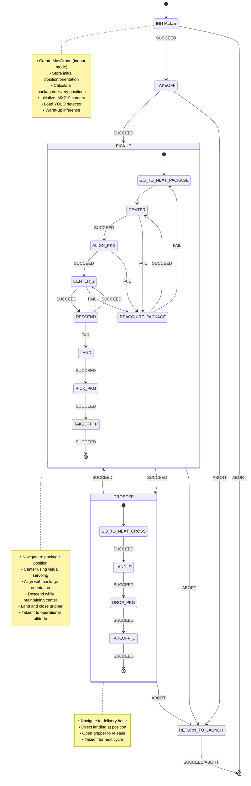

# CBR 2025 - Phase 2: Delivery

## Overview

This package implements an autonomous drone delivery system for Phase 2 of the CBR 2025 Flying Robot League. The objective is to autonomously pick up packages from designated locations and deliver them to target bases using visual servoing and a servo-controlled gripper mechanism.

## Technical Architecture

### Core Components

- **State Machine**: [YASMIN](https://github.com/uleroboticsgroup/yasmin) finite state machine with nested sub-machines for pickup and dropoff operations
- **Object Detection**: [YOLO](https://github.com/ultralytics/ultralytics) models for package and base detection (1000-epoch trained models)
- **Visual Servoing**: Real-time centering and alignment control using proportional controllers
- **Gripper System**: Servo-controlled gripper mechanism via PWM signals
- **SDK**: [MirelaSDK](https://github.com/Black-Bee-Drones/mirela-sdk) for drone control and image processing

### System Requirements

- **Flight Controller**: [ArduPilot](https://ardupilot.org/) with [MAVROS](https://github.com/mavlink/mavros)
- **Positioning**: Indoor positioning system (Visual Odometry)
- **Sensors**: 
  - Arducam IMX219 camera (1640×1232, FOV: 62.2°H × 48.8°V)
  - Servo motor for gripper (PWM control on AUX OUT 4)
- **Computing**: NVIDIA Jetson for onboard YOLO inference

## Mission Strategy

### 1. Pickup Strategy
- **Navigation**: Move to predefined package positions relative to takeoff
- **Visual Centering**: P-controller for XY alignment (Kp=0.00031, tolerance: 31px)
- **Package Alignment**: Yaw control to align with package orientation (1.7 aspect ratio threshold)
- **Descent Control**: Gradual descent with continuous centering
- **Gripper Operation**: Close gripper after landing (PWM: 2106)

### 2. Dropoff Strategy
- **Target Navigation**: Move to delivery base positions
- **Direct Landing**: Land at target position without visual servoing
- **Package Release**: Open gripper to release package (PWM: 1466)
- **Recovery**: Takeoff and return for next package

### 3. Mission Flow
- **Initialization**: Store takeoff position, calculate relative coordinates
- **Cycle**: Pickup → Dropoff → Repeat until all packages delivered
- **RTL**: Return to launch position with L-shaped path to avoid obstacles

## State Machine



## State Descriptions

### Main State Machine

#### INITIALIZE
- **Purpose**: System initialization and mission setup
- **Implementation**: `delivery/states/core.py`
- **Actions**:
  - Create MavDrone instance with `indoor=True`
  - Store initial position and orientation (yaw)
  - Calculate relative positions for packages and delivery bases
  - Initialize ImageHandler with IMX219 camera (1640×1232, flip=2)
  - Load YOLODetector and perform warm-up inference
  - Set `next_package` index to -1 (incremented before use)
- **Transitions**: 
  - SUCCEED → TAKEOFF
  - ABORT → Terminal

#### TAKEOFF
- **Purpose**: Arm and takeoff to operational altitude
- **Implementation**: `delivery/states/core.py`
- **Parameters**: `alt=2.6m` (TAKEOFF_ALTITUDE)
- **Actions**:
  - Execute `arm_takeoff()` command
  - Wait 5 seconds for stabilization
  - Set takeoff position reference
- **Transitions**:
  - SUCCEED → PICKUP
  - ABORT → RETURN_TO_LAUNCH

### Pickup Sub-Machine States

#### GO_TO_NEXT_PACKAGE
- **Purpose**: Navigate to next package position
- **Implementation**: `delivery/states/go_to_target.py`
- **Actions**:
  - Increment package index
  - Get target position from `packages_positions` list
  - Navigate using `offboard_position()` with 60s timeout
  - Search pattern if package not found initially
- **Transitions**:
  - SUCCEED → CENTER
  - ABORT → Main ABORT

#### CENTER
- **Purpose**: Visual servoing to center package in frame
- **Implementation**: `delivery/states/center_on_detection.py`
- **Control**:
  - Error calculation: `error = detection_center - image_center`
  - Velocity: `vel = saturate(Kp × error, min=0.02, max=0.22)`
  - Tolerance: 31 pixels
  - Lost detection limit: 3 frames
- **Transitions**:
  - SUCCEED → ALIGN_PKG (centered)
  - FAIL → REACQUIRE_PACKAGE (lost detection)

#### ALIGN_PKG
- **Purpose**: Rotate drone to align with package orientation
- **Implementation**: `delivery/states/align_pkg.py`
- **Algorithm**:
  - Extract bounding box dimensions
  - Calculate aspect ratio
  - Rotate until ratio < 1.7 (package aligned)
  - Yaw velocity: 0.11 rad/s
- **Transitions**:
  - SUCCEED → CENTER_2
  - FAIL → REACQUIRE_PACKAGE

#### DESCEND
- **Purpose**: Controlled descent while maintaining center
- **Implementation**: `delivery/states/height_controller.py`
- **Parameters**:
  - Descent rate: -0.25m per iteration
  - Minimum altitude: 0.79m above target
- **Transitions**:
  - SUCCEED → CENTER_2 (continue centering)
  - FAIL → LAND (reached minimum altitude)

#### PICK_PKG
- **Purpose**: Close gripper to grab package
- **Implementation**: `delivery/states/gripper_controller.py`
- **Actions**:
  - Send PWM signal: 2106 (close position)
  - Wait 6 seconds for servo movement
- **Transitions**:
  - SUCCEED → TAKEOFF

### Dropoff Sub-Machine States

#### GO_TO_NEXT_CROSS
- **Purpose**: Navigate to delivery base position
- **Implementation**: `delivery/states/go_to_target.py`
- **Actions**:
  - Get target from `deliver_positions` list
  - Direct navigation to coordinates
  - No visual search required
- **Transitions**:
  - SUCCEED → LAND

#### DROP_PKG
- **Purpose**: Open gripper to release package
- **Implementation**: `delivery/states/gripper_controller.py`
- **Actions**:
  - Send PWM signal: 1466 (open position)
  - Wait 6 seconds for servo movement
- **Transitions**:
  - SUCCEED → TAKEOFF

### Shared States

#### REACQUIRE_PACKAGE
- **Purpose**: Recovery when package detection lost
- **Implementation**: `delivery/states/reacquire_target.py`
- **Actions**:
  - Move up 0.5m for wider field of view
  - Scan for package (10s timeout)
  - Return to previous altitude if found
- **Transitions**:
  - SUCCEED → CENTER
  - FAIL → GO_TO_NEXT_PACKAGE

#### RETURN_TO_LAUNCH
- **Purpose**: Return to home position and land
- **Implementation**: `delivery/states/core.py`
- **Actions**:
  - L-shaped path to avoid Phase 4 structure
  - Navigate to initial position
  - Execute landing sequence
- **Transitions**:
  - SUCCEED/ABORT → Terminal

## Key Parameters

### Flight Parameters
- **Operational Altitude**: 2.6m (TAKEOFF_ALTITUDE)
- **Maximum Altitude**: 2.8m (MAX_ALTITUDE)
- **Minimum Centering Altitude**: 0.79m (MIN_CENTERING_ALTITUDE)
- **Descent Step**: -0.25m (TARGET_DOWN_ALTITUDE)
- **Reacquisition Climb**: 0.5m (TARGET_UP_ALTITUDE)

### Visual Control Parameters
- **XY Proportional Gain**: 0.00031 (POSITION_CONTROLLER_KP_XY)
- **Yaw Proportional Gain**: 0.11 (POSITION_CONTROLLER_KP_YAW)
- **XY Velocity Range**: 0.02-0.22 m/s
- **Yaw Velocity Max**: 0.1 rad/s
- **Centering Tolerance**: 31 pixels (POSITION_CONTROLLER_TOLERANCE_XY)

### Package/Delivery Positions (Arena Coordinates)
- **Package Locations**:
  - Package 1: (0.50, -1.80)m
  - Package 2: (0.50, -4.20)m
  - Package 3: (0.50, -6.10)m
- **Delivery Locations**:
  - All deliveries: (3.85, -1.00)m

### Detection Parameters
- **YOLO Models**: 
  - Packages: best1000.pt (1000 epochs)
  - Crosses: yolov11nTC.pt
- **Confidence Threshold**: 0.6
- **Lost Detection Tolerance**: 3 consecutive frames
- **Package Alignment Ratio**: 1.7

### Camera Configuration
- **Camera Model**: Arducam IMX219
- **Resolution**: 1640×1232
- **Horizontal FOV**: 62.2°
- **Vertical FOV**: 48.8°
- **Image Center**: (820, 616)
- **Y-axis Offset**: -218 pixels for package detection
- **Flip**: 2 (180° rotation)

### Gripper Control
- **Servo Pin**: AUX OUT 4
- **Open PWM**: 1466
- **Close PWM**: 2106
- **Operation Time**: 6 seconds

### Timeouts
- **Search Timeout**: 60s
- **Centering Timeout**: 60s
- **Alignment Timeout**: 60s
- **Reacquisition Timeout**: 10s
- **Takeoff Sleep**: 5s

## Mission Execution Flow

### Mission Sequence

1. **Initialization Phase**:
   - Initialize MavDrone with indoor configuration
   - Load YOLO models for package and cross detection
   - Calculate relative positions from takeoff point
   - Initialize camera and perform test detection

2. **Takeoff Phase**:
   - Arm and takeoff to 2.6m altitude
   - Stabilize for 5 seconds
   - Ready for pickup operations

3. **Pickup-Dropoff Cycle**:
   ```
   For each package (1 to 3):
     a. Navigate to package position
     b. Visual servoing loop:
        - Center package in frame (XY control)
        - Align with package orientation (yaw control)
        - Descend while maintaining center
     c. Land when at minimum altitude
     d. Close gripper (6s operation)
     e. Takeoff to operational altitude
     
     f. Navigate to delivery base
     g. Direct landing at coordinates
     h. Open gripper to release package
     i. Takeoff for next cycle
   ```

4. **Return to Launch**:
   - Execute L-shaped path to avoid obstacles
   - Navigate to initial position
   - Land and disarm

### Key Logic Features

- **Visual Servoing**: Continuous centering during approach and descent
- **Package Alignment**: Orientation-aware pickup for reliable gripping
- **Lost Detection Recovery**: Automatic climb and re-search
- **Height-Adaptive Control**: Gain adjustment based on altitude
- **Obstacle Avoidance**: L-shaped RTL path for Phase 4 structure

## Success Criteria

- All packages successfully picked up from designated locations
- All packages delivered to target bases
- Visual centering maintained during pickup operations
- Package alignment achieved before gripping
- Safe return to launch position

## Failure Modes and Recovery

### Visual Detection Failures
- **Lost During Centering**: → REACQUIRE_PACKAGE state
- **Lost During Alignment**: → REACQUIRE_PACKAGE state
- **No Detection at Position**: → Search pattern execution
- **Recovery**: Climb 0.5m for wider field of view

### Navigation Failures
- **Timeout at Waypoint**: → RETURN_TO_LAUNCH
- **Position Error**: Continue with best effort
- **Recovery**: Mission abort with safe RTL

### Gripper Failures
- **Servo Non-Response**: Continue after timeout
- **Package Drop**: No detection, continue mission
- **Recovery**: Complete remaining deliveries

### Mission-Level Recovery
- **Any State Abort**: → RETURN_TO_LAUNCH
- **Emergency Stop**: Land immediately
- **Battery Low**: RTL triggered automatically

## ROS Parameters

The mission uses predefined configurations in `constants.py`:

### Package and Delivery Positions
Positions are calculated relative to the takeoff point and can be modified before mission start.

### Mission Configuration
- Maximum packages: 3
- Delivery location: Single drop-off point
- Starting package index: -1 (auto-increment)

## Implementation Architecture

### Module Structure
```
delivery/
├── mangalarga.py            # Main entry point and state machine
├── mangafina.py             # Simplified test state machine for 1 package
├── cavalinho.py             
├── constants.py             # Configuration parameters
├── state_machines/
│   ├── pickup_sm.py         # Pickup sub-state machine
│   └── dropoff_sm.py        # Dropoff sub-state machine
├── states/
│   ├── core.py              # Initialize, Takeoff, Land, AdjustYaw
│   ├── center_on_detection.py # Visual servoing state
│   ├── align_pkg.py         # Package alignment state
│   ├── go_to_target.py      # Navigation state
│   ├── reacquire_target.py  # Recovery state
│   ├── gripper_controller.py # Servo control state
│   ├── height_controller.py # Altitude control state
│   └── check_pkg.py         # Package verification (unused)
└── utils/
    ├── yolo_detector.py     # YOLO inference wrapper
    ├── image_calculus.py    # Image processing utilities
    └── calculate_target_position.py # Coordinate transformation
```

### State Machine Definition
**File**: `mangalarga.py`
- **Class**: `Delivery(StateMachine)`
- **Framework**: YASMIN state machine with nested sub-machines
- **Entry Point**: `main()` function with YASMIN viewer integration

### Blackboard Variables
The state machine uses shared blackboard for inter-state communication:

| Variable | Type | Description |
|----------|------|-------------|
| `mavdrone` | MavDrone | Drone control interface |
| `image_handler` | ImageHandler | Camera interface |
| `yolo_detector` | YOLODetector | Detection engine |
| `initial_position` | Target | Takeoff position |
| `initial_orientation` | float | Initial yaw angle |
| `packages_positions` | List[Dict] | Package coordinates |
| `deliver_positions` | List[Dict] | Delivery coordinates |
| `next_package` | int | Current package index |

### Visual Servoing Algorithm

**Centering Control**:
```python
# Calculate pixel error
error_x = detection_center_x - IMAGE_CENTER_X
error_y = detection_center_y - IMAGE_CENTER_Y

# Apply proportional control with saturation
vel_x = saturate(Kp × error_y, min_vel, max_vel)  # Y→X mapping
vel_y = saturate(Kp × error_x, min_vel, max_vel)  # X→Y mapping
```

**Alignment Control**:
```python
# Calculate package aspect ratio
ratio = max(width, height) / min(width, height)

# Rotate until aligned
if ratio > 1.7:
    mavdrone.offboard_velocity(angular_z=yaw_velocity)
```

## Testing

### Test Scripts
- `teste.py`: Basic functionality testing
- `tests/test_detection.py`: YOLO detection validation
- `utils/test_servo.py`: Gripper mechanism testing
- `utils/cam_test_node.py`: Camera stream verification
