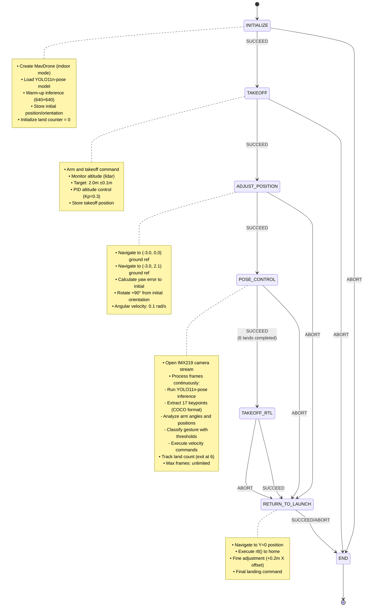

# CBR 2025 - Phase 3: Human Interaction

## Overview

This package implements a gesture-based drone control system for Phase 3 of the CBR 2025 Flying Robot League. The objective is to enable real-time human-drone interaction through body pose recognition, allowing operators to control drone movements using arm gestures without physical controllers.

## Technical Architecture

### Core Components

- **State Machine**: [YASMIN](https://github.com/uleroboticsgroup/yasmin) finite state machine for mission orchestration
- **Pose Detection**: [YOLO11n-pose](https://github.com/ultralytics/ultralytics) model for real-time human pose estimation
- **Gesture Recognition**: Custom keypoint analysis algorithm for gesture classification
- **Control Mapping**: Direct gesture-to-velocity command translation with debouncing
- **SDK**: [MirelaSDK](https://github.com/Black-Bee-Drones/mirela-sdk) for drone control and image processing

### System Requirements

- **Flight Controller**: [ArduPilot](https://ardupilot.org/) with [MAVROS](https://github.com/mavlink/mavros)
- **Positioning**: Indoor positioning system (Visual Odometry)
- **Sensors**: 
  - Arducam IMX219 camera (1640×1232, FOV: 62.2°H × 48.8°V, flip=2)
  - Lidar rangefinder for altitude measurement
- **Computing**: NVIDIA Jetson for onboard YOLO11n-pose inference

## Mission Strategy

### 1. Initialization Phase
- **Drone Setup**: MavDrone initialization with indoor configuration
- **Model Loading**: YOLO11n-pose model (6.2MB PT format)
- **Model Warm-up**: Single inference on zero array for GPU optimization
- **Position Storage**: Record initial position and orientation for RTL

### 2. Positioning Phase  
- **Navigation**: Move to observation position (-3.0, 2.1) meters from origin
- **Yaw Adjustment**: Rotate to face initial orientation + 90° for optimal viewing
- **Altitude**: Maintain 1.0m height for gesture visibility

### 3. Gesture Control Phase
- **Continuous Detection**: Real-time pose inference at 640×640 resolution
- **Gesture Confirmation**: Debouncing mechanism with dual thresholds:
  - Single actions (takeoff/land): 2 frames confirmation
  - Continuous movements: 8 frames confirmation
- **Command Execution**: Velocity commands at 0.05s intervals
- **Exit Condition**: 6 land gestures trigger mission completion

## Gesture Mapping

### Single Action Gestures (2-frame confirmation)
| Gesture | Description | Drone Command | Action |
|---------|-------------|---------------|--------|
| `double_biceps` | Both arms flexed upward (bodybuilder pose) | `arm_takeoff(1.0)` | Takeoff to 1m altitude |
| `cross_arms` | Arms crossed over chest | `land()` | Land and count (6x to exit) |

### Continuous Movement Gestures (8-frame confirmation)
| Gesture | Description | Drone Command | Velocity |
|---------|-------------|---------------|----------|
| `right_arm_up_left_arm_side` | Right arm raised, left arm horizontal | `offboard_velocity(linear_y=-0.2)` | Move left |
| `left_arm_up_right_arm_side` | Left arm raised, right arm horizontal | `offboard_velocity(linear_y=0.2)` | Move right |
| `both_arms_up` | Both arms raised (extended) | `offboard_velocity(linear_z=0.2)` | Move up |
| `both_arms_down` | Both arms pointing down | `offboard_velocity(linear_z=-0.2)` | Move down |
| `right_arm_biceps_left_arm_down` | Right arm flexed, left arm down | `offboard_velocity(linear_x=0.2)` | Move forward |
| `left_arm_biceps_right_arm_down` | Left arm flexed, right arm down | `offboard_velocity(linear_x=-0.2)` | Move backward |
| `left_arm_down_right_arm_side` | Left arm down, right arm horizontal | `offboard_velocity(angular_z=-0.1)` | Yaw right |
| `right_arm_down_left_arm_side` | Right arm down, left arm horizontal | `offboard_velocity(angular_z=0.1)` | Yaw left |
| `neutral` | No clear gesture | `offboard_velocity(0,0,0,0)` | Stop/hover |

## State Machine



## State Descriptions

### INITIALIZE
- **Purpose**: System initialization and model loading
- **Implementation**: `interaction/states/basic_states.py`
- **Actions**:
  - Create MavDrone instance with `indoor=True`, `mavros=False`
  - Initialize YOLODetector and load YOLO11n-pose model
  - Execute warm-up inference on zero array (640×640×3)
  - Store `takeoff_position` from current position
  - Calculate and store `initial_orientation` (yaw angle)
  - Initialize `rtl_land_counter = 0`
- **Transitions**: 
  - SUCCEED → TAKEOFF
  - ABORT → END (model load failure)

### TAKEOFF
- **Purpose**: Arm and takeoff to operational altitude
- **Implementation**: `interaction/states/basic_states.py`
- **Parameters**: `altitude = 2.0m` (TAKEOFF_HEIGHT)
- **Actions**:
  - Execute `arm_takeoff(altitude)` command
  - Monitor altitude in loop (10s timeout):
    - Read current altitude from lidar
    - Calculate error: `altitude - current_alt`
    - Apply PID: `vel_z = clamp(0.3 × error, -0.5, 0.5)`
    - Exit when within ±0.1m tolerance
  - Stop velocity and wait 2s
  - Set takeoff position reference
- **Transitions**:
  - SUCCEED → ADJUST_POSITION
  - ABORT → END (timeout)

### ADJUST_POSITION
- **Purpose**: Position drone for optimal gesture viewing
- **Implementation**: `interaction/states/basic_states.py`
- **Actions**:
  - Navigate to first waypoint:
    - Position: (-3.0, 0.0, 1.0m)
    - Ground reference, 0.15m tolerance
    - 30s timeout, altitude control disabled
  - Navigate to observation position:
    - Position: (-3.0, 2.1, 1.0m)
    - Same navigation parameters
  - Yaw adjustment (if `adjust_yaw=True`):
    - Calculate current yaw from pose
    - Compute error: `initial_yaw - current_yaw`
    - Rotate with `angular_z = -0.1` until error > 87°
- **Transitions**:
  - SUCCEED → POSE_CONTROL
  - ABORT → RETURN_TO_LAUNCH

### POSE_CONTROL
- **Purpose**: Main gesture recognition and control loop
- **Implementation**: `interaction/states/pose_control_state.py`
- **Camera**: IMX219 streaming mode (1640×1232, flip=2)
- **Actions**:
  - Initialize ImageHandler with processing callback
  - For each frame:
    1. **Pose Detection**: Run YOLO11n-pose inference
    2. **Keypoint Extraction**: Get 17 keypoints (COCO format):
       - Shoulders (5,6), Elbows (7,8), Wrists (9,10)
    3. **Gesture Analysis**:
       - Calculate arm angles relative to horizontal
       - Calculate elbow flexion angles
       - Check wrist-shoulder distances for crosses
    4. **Gesture Confirmation**:
       - Track consecutive detections
       - Apply threshold: 2 frames (single) or 8 frames (continuous)
       - Reset on gesture change
    5. **Command Execution**:
       - Single actions: Execute once when confirmed
       - Continuous: Execute every 0.05s while held
       - Neutral: Send stop command
  - Exit condition: `land_count >= max_lands` (default 6)
- **Gesture Recognition Algorithm**:
  ```python
  # Arm angle calculation
  arm_vector = wrist - shoulder
  angle = arctan2(vector_y, vector_x) × 180/π
  
  # Elbow flexion calculation  
  v1 = shoulder - elbow
  v2 = wrist - elbow
  cos_angle = dot(v1, v2) / (norm(v1) × norm(v2))
  flexion = arccos(clip(cos_angle, -1, 1)) × 180/π
  ```
- **Transitions**:
  - SUCCEED → TAKEOFF_RTL (6 lands completed)
  - ABORT → RETURN_TO_LAUNCH

### TAKEOFF_RTL (reuses TAKEOFF state)
- **Purpose**: Takeoff before return to launch
- **Implementation**: Same as TAKEOFF state
- **Actions**: Identical to TAKEOFF with 2.0m target
- **Transitions**:
  - SUCCEED → RETURN_TO_LAUNCH
  - ABORT → RETURN_TO_LAUNCH

### RETURN_TO_LAUNCH
- **Purpose**: Return to home position and land
- **Implementation**: `interaction/states/basic_states.py`
- **Actions**:
  - Navigate to Y=0 position (40s timeout)
  - Execute `rtl()` with default strategy
  - Fine position adjustment:
    - Move +0.2m in X direction
    - 0.1m precision, 30s timeout
  - Execute `land()` command
- **Transitions**:
  - SUCCEED → END
  - ABORT → END

### END
- **Purpose**: Mission finalization and cleanup
- **Implementation**: `interaction/states/basic_states.py`
- **Actions**:
  - Log mission completion message
  - Check armed status
  - Execute safety landing if still armed
  - Clean up resources
- **Transitions**: SUCCEED → [terminal state]

## Key Parameters

### Altitude and Position
- **Operational Altitude**: 2.0m (TAKEOFF_HEIGHT)
- **Pose Altitude**: 1.0m (TAKEOFF_POSE)
- **Altitude Tolerance**: 0.1m (ALTITUDE_TOLERANCE)
- **Position Tolerance**: 0.15m for navigation
- **Observation Position**: (-3.0, 2.1) meters

### Velocity Control
- **Linear Vertical**: ±0.2 m/s (VELOCITY_UP_DOWN)
- **Linear Horizontal**: ±0.2 m/s (VELOCITY_SIDES, VELOCITY_IN_OUT)
- **Angular (Yaw)**: ±0.1 rad/s (VELOCITY_YAW)
- **Command Interval**: 0.05s (ACTION_TIMEOUT)

### Gesture Detection
- **YOLO Model**: yolo11n-pose.pt (6.2MB)
- **Inference Size**: 640×640 (YOLO_IMAGE_SIZE)
- **Confidence Threshold**: 0.65 (YOLO_CONFIDENCE_THRESHOLD)
- **Keypoints**: 17 points in COCO format

### Gesture Confirmation
- **Single Actions**: 2 frames (GESTURE_CONFIRMATION_THRESHOLD_SINGLE)
- **Continuous Actions**: 8 frames (GESTURE_CONFIRMATION_THRESHOLD)
- **Max Gesture Frames**: 300 (currently unused)
- **Land Count Exit**: 6 lands (configurable via ROS param)

### Camera Configuration
- **Camera Model**: Arducam IMX219
- **Resolution**: 1640×1232 
- **Horizontal FOV**: 62.2°
- **Vertical FOV**: 48.8°
- **Flip**: 2 (180° rotation)
- **Processing Mode**: Continuous streaming

### Timing Parameters
- **Takeoff Timeout**: 10s (TAKEOFF_TIMEOUT)
- **Navigation Timeout**: 30-40s per waypoint
- **Sleep After Takeoff**: 2s
- **Sleep After Land**: 1s (in old implementation)

## Mission Execution Flow

### Mission Sequence

1. **Initialization Phase**:
   - Load YOLO11n-pose model and warm up GPU
   - Initialize MavDrone with indoor configuration
   - Store initial position and orientation

2. **Takeoff Phase**:
   - Arm and takeoff to 2.0m altitude
   - PID control for precise altitude
   - Stabilize for 2 seconds

3. **Positioning Phase**:
   - Navigate to observation position (-3.0, 2.1)
   - Rotate to face operator (initial yaw + 90°)
   - Ready for gesture recognition

4. **Gesture Control Loop**:
   ```
   While land_count < 6:
     a. Capture camera frame
     b. Run pose inference (YOLO11n-pose)
     c. Extract arm keypoints (shoulders, elbows, wrists)
     d. Calculate angles and positions
     e. Classify gesture based on rules
     f. Apply confirmation threshold:
        - If new gesture: reset counter
        - If same gesture: increment counter
        - If confirmed: mark for execution
     g. Execute command:
        - Single action: execute once
        - Continuous: execute every 0.05s
        - Neutral: stop all movement
     h. If gesture == "cross_arms":
        - Execute land()
        - Increment land_count
   ```

5. **Return to Launch**:
   - Takeoff to 2.0m if landed
   - Navigate to home position
   - Execute landing sequence

6. **Mission End**:
   - Verify disarmed state
   - Clean up resources
   - Log completion status

### Key Logic Features

- **Gesture Debouncing**: Prevents false positives through frame-based confirmation
- **Differential Thresholds**: Quick response for critical actions (takeoff/land)
- **Continuous Control**: Smooth velocity commands for directional movement
- **Angle-Based Recognition**: Robust gesture classification using arm angles
- **Safety Stop**: Automatic hover on neutral or lost gesture
- **Exit Strategy**: Configurable land count for mission completion

## ROS Parameters

### `max_lands` (integer, default: 6)
Maximum number of land gestures before mission completion.

**Implementation**: Checked in POSE_CONTROL state main loop

**Usage:**
```bash
ros2 run interaction sm_interaction --ros-args -p max_lands:=3
```

## Implementation Architecture

### Module Structure
```
interaction/
├── sm_interaction.py        # Main entry point and state machine
├── constants.py             # Configuration parameters
├── states/
│   ├── basic_states.py      # Initialize, Takeoff, AdjustPosition, RTL, End
│   └── pose_control_state.py # Main gesture recognition and control
├── utils/
│   └── yolo_detector.py     # YOLO11n-pose inference wrapper
└── test/
    └── test_detection.py    # Standalone gesture detection test
```


### Gesture Recognition Algorithm

**Angle Calculation**:
```python
# Arm angle relative to horizontal
arm_vector = wrist - shoulder
angle = arctan2(arm_vector[1], arm_vector[0]) × 180/π

# Elbow flexion angle
v1 = shoulder - elbow
v2 = wrist - elbow
cos_angle = dot(v1, v2) / (norm(v1) × norm(v2))
flexion = arccos(clip(cos_angle, -1, 1)) × 180/π
```

**Gesture Classification Rules**:
```python
# Example: Double biceps detection
if (left_angle ∈ [-150°, -30°] and
    right_angle ∈ [-150°, -30°] and
    left_elbow_angle ∈ [40°, 100°] and
    right_elbow_angle ∈ [40°, 100°] and
    left_wrist.y < left_elbow.y and
    right_wrist.y < right_elbow.y):
    return "double_biceps"
```

**Confirmation Logic**:
```python
if gesture != previous_gesture:
    reset_counter()
else:
    increment_counter()
    if counter >= threshold:
        confirm_gesture()
        execute_command()
```

## Testing

### Standalone Test Script
**File**: `interaction/test/test_detection.py`
- Replicates exact POSE_CONTROL state behavior
- Visualizes skeleton and gesture detection
- Displays confirmation progress
- Logs drone commands without execution

**Usage**:
```bash
ros2 run interaction test_detection [--no-viz]
```
