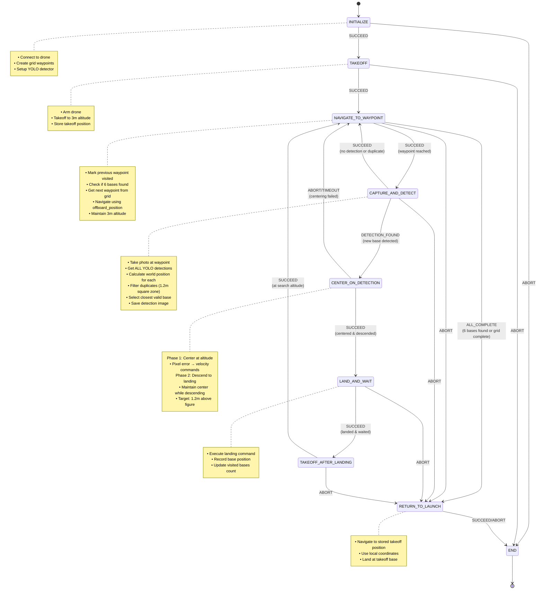

# CBR 2025 - Phase 1: Localization and Mapping

## Overview

This package implements an autonomous drone solution for Phase 1 of the CBR 2025 Flying Robot League. The objective is to autonomously explore an 8x8m arena, detect and land on 6 landing bases (1x1m plates at varying heights 0-1.5m), and return to the takeoff position.

## Technical Architecture

### Core Components

- **State Machine**: YASMIN-based finite state machine for mission control
- **Navigation**: MAVROS API with PID control for precise indoor positioning
- **Detection**: YOLO-based computer vision for landing base identification
- **Grid Coverage**: Boustrophedon pattern for systematic arena exploration

### System Requirements

- **Flight Controller**: PX4/ArduPilot with MAVROS
- **Positioning**: Indoor positioning system (SLAM/Visual Odometry)
- **Sensors**: 
  - Lidar rangefinder for altitude measurement
  - Camera (1280x720) for base detection
- **Computing**: NVIDIA Jetson for onboard processing

## Mission Strategy

### 1. Search Pattern
- **Boustrophedon Grid**: Column-wise traversal with 2m spacing
- **Coverage**: 7x7m search area with 16 waypoints
- **Altitude**: Constant 3m above ground (safe clearance for 1.5m plates)
- **Camera FOV**: 3.63m x 2.73m coverage at 3m height

### 2. Detection Strategy
- **YOLO Model**: Real-time detection at each waypoint
- **Position-Based Filtering**: Calculate world position of each detection
- **Duplicate Prevention**: 1.2m square exclusion zone (separate X/Y checks)
- **Multi-Detection Handling**: Selects closest valid base when multiple detected
- **Confidence Threshold**: 0.65 for reliable detection

### 3. Landing Approach
- **Phase 1 Centering**: Maintain altitude while centering over target
- **Phase 2 Descent**: Controlled descent to 1.2m above figure
- **Landing**: Precision landing with visual feedback

## State Machine

## State Descriptions

### INITIALIZE
- **Purpose**: System initialization and mission setup
- **Actions**:
  - Create MavDrone instance with indoor configuration
  - Store initial position as takeoff reference
  - Generate grid waypoints (16 points, 2m spacing)
  - Initialize YOLO detector for base recognition
- **Transitions**: 
  - SUCCEED → TAKEOFF
  - ABORT → END

### TAKEOFF
- **Purpose**: Arm and takeoff to search altitude
- **Actions**:
  - Store takeoff position for RTL (first takeoff only)
  - Arm drone and initiate takeoff
  - Monitor altitude via lidar until reaching 3m ±0.1m
  - Stabilize at search altitude
- **Transitions**:
  - SUCCEED → NAVIGATE_TO_WAYPOINT
  - ABORT → END

### NAVIGATE_TO_WAYPOINT
- **Purpose**: Navigate to next grid waypoint
- **Actions**:
  - Mark previous waypoint as visited
  - Check mission completion (6 bases or grid complete)
  - Get next waypoint coordinates
  - Calculate relative position delta
  - Execute offboard_position command with PID control
- **Transitions**:
  - SUCCEED → CAPTURE_AND_DETECT
  - ALL_COMPLETE → RETURN_TO_LAUNCH
  - ABORT → RETURN_TO_LAUNCH

### CAPTURE_AND_DETECT
- **Purpose**: Detect landing bases at current position
- **Actions**:
  - Capture image from bottom-facing camera
  - Run YOLO inference for all detections (confidence > 0.65)
  - Calculate world position for each detection using camera geometry
  - Filter duplicates using 1.2m square exclusion zones (separate X/Y checks)
  - Select closest valid detection to drone
  - Save annotated detection image
- **Transitions**:
  - SUCCEED → NAVIGATE_TO_WAYPOINT (no/duplicate detection)
  - DETECTION_FOUND → CENTER_ON_DETECTION
  - ABORT → RETURN_TO_LAUNCH

### CENTER_ON_DETECTION
- **Purpose**: Precision alignment and descent to landing altitude
- **Target Tracking**: Locks onto specific detection from CaptureAndDetect
  - Stores target center coordinates from selected detection
  - Matches target across frames (200px threshold)
  - Ensures centering on same base throughout maneuver
- **Phase 1 - Centering**:
  - Track target detection across all YOLO results
  - Calculate pixel error from image center (820, 616)
  - Apply proportional control: vel = error × 0.00031
  - Maintain current altitude
  - Tolerance: 40 pixels
- **Phase 2 - Descent**:
  - Continue tracking target detection
  - Descend using altitude control (Kp=0.16)
  - Target altitude: 1.2m above figure (via lidar)
  - Continue centering with reduced gain (0.7×)
- **Transitions**:
  - SUCCEED → LAND_AND_WAIT
  - ABORT/TIMEOUT → NAVIGATE_TO_WAYPOINT

### LAND_AND_WAIT
- **Purpose**: Execute landing and wait period
- **Actions**:
  - Send landing command
  - Wait for touchdown (8 seconds)
  - Record landing position in visited_bases
  - Wait 15 seconds (competition requirement)
  - Log mission progress (X/6 bases)
- **Transitions**:
  - SUCCEED → TAKEOFF_AFTER_LANDING
  - ABORT → RETURN_TO_LAUNCH

### TAKEOFF_AFTER_LANDING (reuses TAKEOFF state)
- **Purpose**: Resume search after landing
- **Actions**:
  - Arm and takeoff to 3m
  - No position storage (not first takeoff)
  - Continue from current position
- **Transitions**:
  - SUCCEED → NAVIGATE_TO_WAYPOINT
  - ABORT → RETURN_TO_LAUNCH

### RETURN_TO_LAUNCH
- **Purpose**: Return to takeoff position and land
- **Actions**:
  - Log mission summary (waypoints/bases visited)
  - Calculate delta to takeoff position
  - Navigate using offboard_position
  - Execute final landing
- **Transitions**:
  - SUCCEED/ABORT → END

### END
- **Purpose**: Mission cleanup
- **Actions**:
  - Ensure drone is disarmed
  - Log final mission report
  - Success if 6/6 bases visited

## Key Parameters

### Navigation
- **Grid Spacing**: 2.0m (45% overlap with camera FOV)
- **Position Tolerance**: 0.3m
- **Navigation Timeout**: 30s per waypoint
- **Velocity**: 0.8 m/s between waypoints

### Detection
- **YOLO Confidence**: 0.7
- **Image Size**: 640×640
- **Centering Tolerance**: 20 pixels
- **Centering Gain**: 0.002 m/s per pixel

### Altitude Control
- **Search Altitude**: 3.0m
- **Landing Altitude**: 1.2m above figure
- **Altitude Tolerance**: 0.1m
- **Descent Rate**: 0.2 m/s

### Timing
- **Takeoff Timeout**: 20s
- **Centering Timeout**: 15s
- **Land Wait Time**: 15s

## Mission Execution Flow

1. **Initialization**: Setup drone connection, grid, and detectors
2. **Takeoff**: Reach 3m altitude and store home position
3. **Search Loop**:
   - Navigate to next waypoint
   - Capture and detect at position
   - If new base found: center → land → wait → takeoff
   - Continue until 6 bases found or grid complete
4. **Return**: Navigate back to takeoff position
5. **Landing**: Final landing at home position

## Success Criteria

- All 6 landing bases detected and visited
- Each base landed on exactly once
- Successful return to takeoff position
- Mission completed within time limit

## Failure Modes

- **Navigation Abort**: Timeout or position error → RTL
- **Detection Loss**: Lost visual during centering → Skip base
- **Altitude Issues**: Lidar failure → Abort mission
- **Battery Low**: Immediate RTL

## Dependencies

- `mirela_sdk`: Drone control and image processing
- `yasmin`: State machine framework
- `mavros`: PX4/ArduPilot interface
- `ultralytics`: YOLO inference engine
