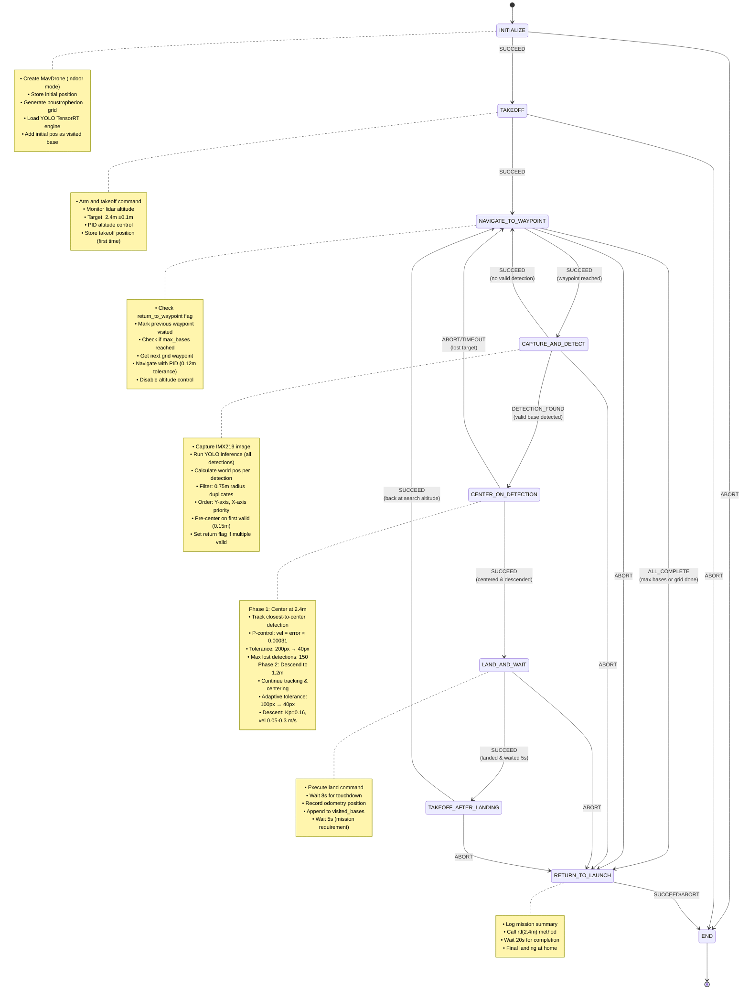

# CBR 2025 - Phase 1: Localization and Mapping

## Overview

This package implements an autonomous drone solution for Phase 1 of the CBR 2025 Flying Robot League. The objective is to autonomously explore an 8x8m arena, detect and land on 6 landing bases (1x1m plates at varying heights 0-1.5m), and return to the takeoff position.

## Technical Architecture

### Core Components

- **State Machine**: [YASMIN](https://github.com/uleroboticsgroup/yasmin) finite state machine for mission orchestration
- **Navigation**: MAVROS API with PID control for precise indoor positioning  
- **Detection**: [YOLO](https://github.com/ultralytics/ultralytics) based computer vision (TensorRT engine) for landing base identification
- **Grid Coverage**: Configurable boustrophedon pattern for arena navigation
- **SDK**: [MirelaSDK](https://github.com/Black-Bee-Drones/mirela-sdk) for drone control and image processing

### System Requirements

- **Flight Controller**: [ArduPilot](https://ardupilot.org/) with [MAVROS](https://github.com/mavlink/mavros)
- **Positioning**: Indoor positioning system (Visual Odometry)
  - We use [Isaac ROS vSLAM](https://nvidia-isaac-ros.github.io/repositories_and_packages/isaac_ros_visual_slam/index.html) with a [Intel RealSense D435i](https://nvidia-isaac-ros.github.io/getting_started/hardware_setup/sensors/realsense_setup.html) camera and [Jetson Orin Nano Super](https://developer.nvidia.com/jetson-orin-nano-super) for onboard inference.
- **Sensors**: 
  - Lidar rangefinder for altitude measurement
  - Arducam IMX219 camera (1640x1232, FOV: 62.2°H × 48.8°V)
- **Computing**: NVIDIA Jetson for onboard YOLO inference

## Mission Strategy

### 1. Search Pattern
- **Boustrophedon Grid**: Configurable column/row-based traversal with 1.25m spacing
- **Coverage**: 5x5m search area (configurable pattern type and directions)
- **Altitude**: Constant 2.4m above ground (safe clearance for 1.5m plates)
- **Grid Configuration**: Start offset (-0.5m, 0.75m) from initial position
- **Pattern**: COLUMNS pattern with BACKWARD primary direction and LEFT transition

### 2. Detection Strategy
- **YOLO Model**: TensorRT-optimized detection at each waypoint (640×640 input size)
- **Multi-Detection Processing**: Processes all detections in single capture
- **Position Estimation**: Calculates world position using camera FOV and altitude
- **Duplicate Prevention**: 0.75m radius exclusion zone around visited bases
- **Detection Ordering**: Prioritizes detections by Y-axis (direction-aware) then X-axis
- **Multi-Base Handling**: Returns to waypoint if multiple valid bases detected
- **Confidence Threshold**: 0.65 minimum confidence
- **Pre-Centering**: Rough positioning before precision centering phase

### 3. Landing Approach
- **Pre-Positioning**: Navigate to estimated detection position (0.15m tolerance)
- **Phase 1 - Centering**: Maintain 2.4m altitude while centering (200px tolerance, 40px final)
- **Phase 2 - Descent**: Controlled descent to 1.2m with concurrent centering (100px→40px adaptive tolerance)
- **Visual Tracking**: Locks onto closest-to-center detection throughout maneuver
- **Landing**: Executes landing command and waits 5 seconds

## State Machine



## State Descriptions

### INITIALIZE
- **Purpose**: System initialization and mission setup
- **Implementation**: `mapping/states/basic_states.py`
- **Actions**:
  - Store `max_bases_to_visit` configuration (+1 for home base) in blackboard
  - Create MavDrone instance with `indoor=True` configuration
  - Store initial drone position from vision odometry
  - Store takeoff position as `get_position_as_target`
  - Generate boustrophedon grid using Grid utility with configured parameters:
    - Search area: 5×5m with 1.25m spacing
    - Pattern: COLUMNS, BACKWARD primary, LEFT transition
    - Start offset: (-0.5, 0.75) from initial position
  - Initialize YOLODetector and warm-up inference
  - Add initial position to `visited_bases` list (home base)
  - Initialize blackboard variables: `current_target_waypoint`, `current_detection`, `return_to_waypoint`
  - Display grid pattern summary and visualization
- **Transitions**: 
  - SUCCEED → TAKEOFF
  - ABORT → END (on exception)

### TAKEOFF
- **Purpose**: Arm and takeoff to search altitude
- **Implementation**: `mapping/states/basic_states.py`
- **Actions**:
  - Check and store takeoff position if not already stored (first takeoff only)
  - Execute `arm_takeoff(TAKEOFF_ALTITUDE - 1)` command (1.4m initial)
  - Delay 3 seconds for stabilization
  - Monitor lidar altitude in loop (max 12s timeout):
    - Read `get_rng_alt.range` for current altitude
    - Calculate altitude error: `TAKEOFF_ALTITUDE - current_alt`
    - Apply PID correction: `vel_z = clamp(0.3 × error, -0.5, 0.5)`
    - Exit when within ±0.1m tolerance
  - Stop velocity commands and delay 2s
  - Set takeoff position reference
- **Transitions**:
  - SUCCEED → NAVIGATE_TO_WAYPOINT (altitude reached)
  - ABORT → END (timeout or exception)

### NAVIGATE_TO_WAYPOINT
- **Purpose**: Navigate to next grid waypoint or return to current waypoint
- **Implementation**: `mapping/states/navigation_states.py`
- **Actions**:
  - Check `return_to_waypoint` flag:
    - If True: reuse current waypoint, reset flag
    - If False: mark previous waypoint visited, advance to next
  - Check mission completion conditions:
    - If `len(visited_bases) >= max_bases_to_visit`: return ALL_COMPLETE
    - If `grid_waypoints.get_next_waypoint() is None`: return ALL_COMPLETE
  - Get target waypoint from grid (boustrophedon order)
  - Store waypoint in blackboard and advance grid index
  - Execute navigation:
    - `offboard_position(x, y, z=2.4m)`
    - `precision_radius=0.12m`
    - `timeout_sec=30s`
    - `strategy="PID"`
    - `ground_reference=True`
    - `disable_altitude_control=True`
  - Stop velocity and delay 0.5s on arrival
- **Transitions**:
  - SUCCEED → CAPTURE_AND_DETECT (waypoint reached)
  - ALL_COMPLETE → RETURN_TO_LAUNCH (mission conditions met)
  - ABORT → RETURN_TO_LAUNCH (navigation failure)

### CAPTURE_AND_DETECT
- **Purpose**: Detect and filter landing bases at current position
- **Implementation**: `mapping/states/navigation_states.py`
- **Camera**: IMX219 (1640×1232, flip=2)
- **Actions**:
  - Open ImageHandler with IMX219Config
  - Capture single image frame
  - Save raw image with timestamp
  - Run YOLO inference with `return_all=True` (all detections)
  - If detections found:
    - Get current drone position and lidar altitude
    - For each detection:
      - Calculate pixel offset from image center (820, 616+189)
      - Convert to meters using camera FOV and altitude:
        - `meters_per_px = 2 × altitude × tan(FOV/2) / resolution`
      - Compute world position: `(drone_x + offset_x, drone_y + offset_y)`
      - Check if duplicate: `distance < 0.75m` from any visited base
      - Keep only non-duplicate detections
    - Order valid detections:
      - Primary: Y-axis (bottom-first if forward, top-first if backward)
      - Secondary: X-axis (right to left)
    - Select first ordered valid detection
    - Clip estimated position to grid bounds
    - Pre-center: navigate to estimated position (0.15m tolerance, 10s timeout)
    - Set `return_to_waypoint=True` if multiple valid detections remain
    - Store detection in blackboard
  - Close camera
- **Transitions**:
  - DETECTION_FOUND → CENTER_ON_DETECTION (valid base found)
  - SUCCEED → NAVIGATE_TO_WAYPOINT (no detection or all duplicates)
  - ABORT → RETURN_TO_LAUNCH (camera/detection failure)

### CENTER_ON_DETECTION
- **Purpose**: Precision visual servoing and controlled descent
- **Implementation**: `mapping/states/detection_states.py`
- **Camera**: IMX219 streaming mode
- **Target Tracking**: Selects closest-to-center detection each frame
- **Phase 1 - Centering at Altitude** (35s timeout):
  - Stream camera frames continuously
  - Run YOLO inference each frame with `return_all=True`
  - Select detection closest to image center (820, 616)
  - Calculate pixel error: `(center_x - 820, center_y - 616)`
  - Lost detection handling: abort after 150 consecutive losses
  - Velocity control:
    - `vel_x = saturate(error_y × 0.00031, min=0.06, max=0.21)`
    - `vel_y = saturate(error_x × 0.00031, min=0.06, max=0.21)`
  - Exit condition: `|error_x| < 40px AND |error_y| < 40px`
  - Stop velocity and close camera
- **Phase 2 - Descent with Centering** (35s timeout):
  - Reopen camera stream
  - Adaptive tolerance: 100px until 0.4m above target, then 40px
  - Concurrent control loops:
    - Altitude: Read lidar, compute `error_z = current - 1.2m`
      - `vel_z = clamp(0.16 × error_z, 0.05, 0.3)` with sign
    - Horizontal: Same YOLO tracking, reduced gain (0.7×)
      - Apply velocity only if error exceeds adaptive threshold
  - Exit condition: `error_z < 0.1m`
  - Stop velocity, close camera, delay 1.5s
- **Transitions**:
  - SUCCEED → LAND_AND_WAIT (both phases complete)
  - ABORT → NAVIGATE_TO_WAYPOINT (lost target in phase 1)
  - TIMEOUT → NAVIGATE_TO_WAYPOINT (35s exceeded)

### LAND_AND_WAIT
- **Purpose**: Execute landing sequence and record base
- **Implementation**: `mapping/states/detection_states.py`
- **Actions**:
  - Execute `mavdrone.land()` command
  - Wait 8 seconds for touchdown stabilization
  - Read current odometry position from vision system
  - Create landing record:
    ```python
    {
        "x": odometry.x,
        "y": odometry.y, 
        "z": odometry.z,
        "timestamp": time.time()
    }
    ```
  - Append to `visited_bases` list
  - Log: "Base N landed at (x, y)"
  - Display progress: "Total bases visited: N/max_bases"
  - Wait 5 seconds (competition requirement)
- **Transitions**:
  - SUCCEED → TAKEOFF_AFTER_LANDING (landing complete)
  - ABORT → RETURN_TO_LAUNCH (landing failure)

### TAKEOFF_AFTER_LANDING (reuses TAKEOFF state)
- **Purpose**: Resume search altitude after landing
- **Implementation**: Same as TAKEOFF state
- **Actions**: Identical to TAKEOFF, but `takeoff_position` already stored
- **Transitions**:
  - SUCCEED → NAVIGATE_TO_WAYPOINT (resume search)
  - ABORT → RETURN_TO_LAUNCH (takeoff failure)

### RETURN_TO_LAUNCH
- **Purpose**: Return to home position and land
- **Implementation**: `mapping/states/basic_states.py`
- **Actions**:
  - Validate `takeoff_position` exists in blackboard
  - Log mission summary:
    - Waypoints visited: `progress['visited_waypoints']/total_waypoints`
    - Landing bases: `len(visited_bases)`
    - Completion rate: `N/max_bases`
  - Execute return sequence:
    - Read current position from odometry
    - Call `mavdrone.rtl(TAKEOFF_ALTITUDE)` method
    - Wait 20 seconds for completion
  - Final landing executed by rtl() method
- **Transitions**:
  - SUCCEED → END (returned and landed)
  - ABORT → END (rtl failure)

### END
- **Purpose**: Mission finalization and cleanup
- **Implementation**: `mapping/states/basic_states.py`
- **Actions**:
  - Check if drone still armed: execute safety landing if needed
  - Generate final mission report:
    - Grid coverage percentage
    - Waypoints visited/total
    - Landing bases count
    - Success rate: `len(visited_bases)/max_bases`
  - Log mission outcome:
    - "MISSION COMPLETED SUCCESSFULLY!" if all bases visited
    - "Mission partially completed" otherwise
  - Clean up resources
- **Transitions**: SUCCEED → [terminal state]

## Key Parameters

### Arena and Grid Configuration
- **Arena Dimensions**: 8×8m
- **Search Area**: 5×5m (SEARCH_AREA_WIDTH/HEIGHT)
- **Grid Spacing**: 1.25m (GRID_SPACING)
- **Pattern Type**: COLUMNS (boustrophedon)
- **Primary Direction**: BACKWARD (-X direction)
- **Transition Direction**: LEFT (+Y direction)
- **Start Offset**: (-0.5, 0.75) from initial position
- **Max Bases**: 6 (configurable via ROS param)

### Navigation Parameters
- **Position Tolerance**: 0.12m (POSITION_TOLERANCE)
- **Navigation Timeout**: 30s per waypoint (SEARCH_TIMEOUT)
- **Navigation Strategy**: PID with ground reference
- **Altitude Control**: Disabled during horizontal navigation

### Altitude Parameters
- **Search Altitude**: 2.4m (TAKEOFF_ALTITUDE)
- **Centering Altitude**: 1.2m above figure (CENTERING_ALTITUDE)
- **Altitude Tolerance**: 0.1m (ALTITUDE_TOLERANCE)
- **Takeoff Initial**: 1.4m (TAKEOFF_ALTITUDE - 1)
- **Altitude PID Gain**: 0.3 (takeoff), 0.16 (descent - DESCEND_KP)
- **Descent Velocity**: 0.05-0.3 m/s (clamped)

### Detection Parameters
- **YOLO Model**: TensorRT engine (best.engine)
- **Inference Size**: 640×640 (YOLO_IMAGE_SIZE)
- **Confidence Threshold**: 0.65 (YOLO_CONFIDENCE_THRESHOLD)
- **Duplicate Detection Radius**: 0.75m (DUPLICATE_BASE_RADIUS)
- **Detection Save Path**: `share/detections_phase1/`

### Camera Configuration
- **Camera Model**: Arducam IMX219
- **Resolution**: 1640×1232 (CAMERA_RESOLUTION_WIDTH/HEIGHT)
- **Horizontal FOV**: 62.2° (CAMERA_FOV_HORIZONTAL)
- **Vertical FOV**: 48.8° (CAMERA_FOV_VERTICAL)
- **Image Center**: (820, 616) with 189px Y offset (IMAGE_CENTER_X/Y/OFFSET_Y)
- **Pitch**: -90° (downward facing)
- **Flip**: 2 (180° rotation)

### Centering Control
- **Proportional Gain**: 0.00031 m/s per pixel (CENTERING_P_GAIN)
- **Velocity Saturation**: 0.06-0.21 m/s (CENTERING_VEL_MIN/MAX)
- **Phase 1 Tolerance**: 40px final (CENTER_DETECTION_THRESHOLD)
- **Phase 2 Initial Tolerance**: 200px → 100px → 40px adaptive (CENTERING_TOLERANCE_PX)
- **Phase 2 Gain Reduction**: 0.7× for horizontal velocity
- **Centering Timeout**: 35s total (CENTERING_TIMEOUT)
- **Lost Detection Limit**: 150 consecutive frames

### Timing Parameters
- **Takeoff Timeout**: 12s (TAKEOFF_TIMEOUT)
- **Touchdown Wait**: 8s
- **Land Wait Time**: 5s (LAND_WAIT_TIME)
- **RTL Wait**: 20s
- **Pre-center Timeout**: 10s

## Mission Execution Flow

### Mission Sequence

1. **Initialization Phase**:
   - Initialize MavDrone with indoor configuration
   - Generate boustrophedon grid (COLUMNS, BACKWARD, LEFT, 1.25m spacing)
   - Load YOLO TensorRT model and warm-up
   - Record home base as first visited location
   - Display grid pattern visualization

2. **Takeoff Phase**:
   - Arm and execute takeoff to 1.4m initial altitude
   - Monitor lidar and apply PID control to reach 2.4m
   - Store takeoff position reference for RTL
   - Stabilize for 2 seconds

3. **Search Loop** (until `max_bases` reached or grid exhausted):
   ```
   For each waypoint in boustrophedon order:
     a. Navigate to waypoint (0.12m tolerance, PID control)
     b. Capture image and run YOLO inference
     c. Calculate world position for all detections
     d. Filter duplicates (0.75m radius from visited bases)
     e. Order remaining detections (Y-axis priority)
     
     If valid detection(s) found:
       i.   Pre-center to estimated position (0.15m tolerance)
       ii.  Phase 1: Visual servoing at 2.4m altitude (40px tolerance)
       iii. Phase 2: Controlled descent to 1.2m with tracking
       iv.  Land and record position
       v.   Wait 5 seconds
       vi.  Takeoff back to 2.4m
       
       If multiple valid detections:
         - Set return_to_waypoint flag
         - Return to same waypoint after landing
         - Continue processing remaining bases
     
     Else:
       Continue to next waypoint
   ```

4. **Return to Launch**:
   - Log mission statistics
   - Execute `rtl(2.4m)` command
   - Wait 20 seconds for autonomous return and landing

5. **Mission End**:
   - Verify disarmed state (safety landing if needed)
   - Generate completion report
   - Display success/partial completion status

### Key Logic Features

- **Multi-Detection Handling**: Processes multiple bases at single waypoint by returning after each landing
- **Duplicate Prevention**: Maintains `visited_bases` list with 0.75m exclusion radius
- **Direction-Aware Ordering**: Prioritizes bases by movement direction (forward→bottom-first, backward→top-first)
- **Adaptive Centering**: Adjusts tolerance during descent (100px→40px when approaching target)
- **Pre-Positioning**: Rough navigation to estimated position before visual servoing
- **Home Base Counting**: Initial position counted as visited base (hence `max_bases + 1`)

## Success Criteria

- All configured bases detected and visited (default: 6 landing bases + 1 home)
- Each base visited exactly once (duplicate filtering)
- Successful return to takeoff position via RTL
- Mission completed within operational constraints

## Failure Modes and Recovery

### Navigation Failures
- **Timeout at Waypoint**: Abort navigation → Return to Launch
- **Position Error**: Exceeds tolerance → Abort to RTL
- **Recovery**: Mission terminates with partial completion status

### Detection Failures
- **No Detections**: Continue to next waypoint (no abort)
- **All Duplicates**: Continue search pattern
- **Camera Failure**: Abort state → Return to Launch
- **Recovery**: Grid exploration continues

### Centering Failures
- **Phase 1 Lost Target**: 150 consecutive losses → Abort to next waypoint
- **Phase 2 Timeout**: 35s exceeded → Abort to next waypoint  
- **Detection Lost During Descent**: Continue with last known position
- **Recovery**: Skip problematic base, continue mission

### Altitude Control Failures
- **Lidar Data Loss**: PID control uses last valid reading
- **Takeoff Timeout**: 12s exceeded → Abort to END state
- **Recovery**: Mission-critical failure, terminate safely

### Mission-Level Recovery
- **Any State Abort**: Falls through to RETURN_TO_LAUNCH
- **RTL Failure**: Proceeds to END state regardless
- **Final Safety**: END state checks armed status and executes emergency landing if needed

## ROS Parameters

The mission can be configured using ROS 2 parameters:

### `bases` (integer, default: 6)
Maximum number of landing bases to visit before completing the mission.

**Implementation**: Stored as `max_bases_to_visit = bases + 1` in blackboard (includes home base)

**Usage:**
```bash
ros2 run mapping mangalarga --ros-args -p bases:=3
```

This parameter is useful for:
- **Testing**: Validate mission logic with fewer bases
- **Competition Adaptation**: Skip problematic plates if some bases are unreachable
- **Time Management**: Reduce mission duration when time-constrained

**Example**: Setting `bases:=3` will visit 3 landing bases (plus home base = 4 total in visited_bases list) before triggering ALL_COMPLETE and returning to launch.

## Implementation Architecture

### Module Structure
```
mapping/
├── mangalarga.py           # Main entry point and state machine definition
├── constants.py            # Configuration parameters
├── states/
│   ├── basic_states.py     # Initialize, Takeoff, ReturnToLaunch, End
│   ├── navigation_states.py # NavigateToWaypoint, CaptureAndDetect
│   └── detection_states.py # CenterOnDetection, LandAndWait
└── utils/
    ├── grid.py             # Boustrophedon pattern generator
    └── yolo_detector.py    # YOLO inference wrapper
```

### State Machine Definition
**File**: `mangalarga.py`
- **Class**: `CBRPhase1StateMachine(StateMachine)`
- **Framework**: YASMIN state machine with blackboard pattern
- **Entry Point**: `main()` function initializes ROS2, creates state machine, executes mission

### Blackboard Variables
The state machine uses a shared blackboard for inter-state communication:

| Variable | Type | Description |
|----------|------|-------------|
| `mavdrone` | MavDrone | Drone control interface (MirelaSDK) |
| `yolo_detector` | YOLODetector | YOLO inference engine |
| `grid_waypoints` | Grid | Boustrophedon waypoint generator |
| `visited_bases` | List[Dict] | Positions of all visited bases (x, y, z, timestamp) |
| `initial_position` | Tuple[float, float, float] | Drone start position |
| `takeoff_position` | Target | Stored position for RTL |
| `current_target_waypoint` | Dict | Current grid waypoint being processed |
| `current_detection` | Dict | Active detection being tracked |
| `return_to_waypoint` | bool | Flag to revisit waypoint for multiple bases |
| `max_bases_to_visit` | int | Configured maximum bases (param + 1) |

### Control Flow Logic

**Position Estimation Algorithm**:
```python
# Calculate meters per pixel at current altitude
coverage_width = 2 × altitude × tan(FOV_H / 2)
meters_per_px_x = coverage_width / RESOLUTION_WIDTH

# Convert pixel offset to world coordinates
pixel_offset_x = detection_center_x - IMAGE_CENTER_X
offset_meters_x = pixel_offset_y × meters_per_px_y  # Note: Y→X mapping
estimated_world_x = drone_x + offset_meters_x
```

**Duplicate Detection Check**:
```python
for base in visited_bases:
    distance = sqrt((est_x - base.x)² + (est_y - base.y)²)
    if distance < 0.75:
        return DUPLICATE
```

**Detection Ordering**:
```python
# Primary sort: Y-axis (direction-dependent)
# Secondary sort: X-axis (right to left)
sorted_detections = sorted(detections, 
    key=lambda d: (
        -d.center_y if moving_forward else d.center_y,  # Bottom-first or top-first
        -d.center_x  # Right to left
    )
)
```

**Velocity Saturation**:
```python
def saturate(value, min_vel, max_vel):
    if value == 0:
        return 0.0
    magnitude = max(min_vel, min(max_vel, abs(value)))
    return magnitude × sign(value)
```
