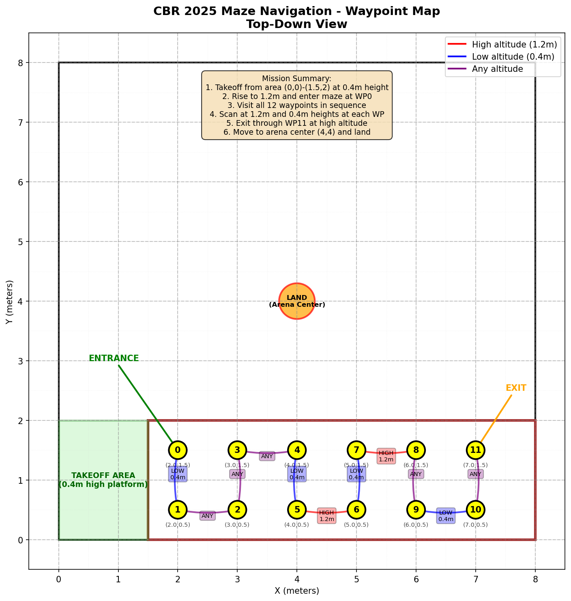

# CBR 2025 Phase 4 - Maze Navigation

Autonomous Tello drone maze exploration with QR code detection for the Flying Robot League (FRL) competition.

## Overview

This ROS2 package implements an autonomous navigation system for a Tello drone to:
- Navigate through a dark, enclosed maze (1.5m high)
- Detect QR codes on maze walls
- Map the maze using a grid-based approach
- Visit 12 points using a two-height scanning strategy

## Features

- **Autonomous Navigation**: Grid-based exploration with 1m x 1m sections
- **Two-Height Scanning**: Scans at high (0.8m) and low (0.3m) heights
- **QR Code Detection**: Robust detection using qreader library with YOLOv8 backend
- **Dual Camera Support**: Test with Tello drone camera or standard webcam
- **Lidar Integration**: WebSocket interface for ESP-attached lidar sensor
- **State Machine**: Robust Yasmin-based state machine for mission control
- **Safety Features**: Emergency stop, battery monitoring, graceful shutdown

## System Architecture

The system uses a hierarchical state machine with the following states:
1. **Initialize**: Connect to Tello and initialize components
2. **Takeoff**: Take off to entry height (0.5m)
3. **Enter Maze**: Move through entrance gate
4. **Scan Position**: 360° scan at two heights with photo capture
5. **Analyze Passages**: Determine next navigation target using hardcoded path
6. **Navigate to Passage**: Move to next grid position
7. **Land**: Move to arena center (1.5m forward, 3.5m left) and land

### Navigation Strategy

The maze navigation uses a **waypoint serpentine path** optimized for the competition:
- Predefined sequence of 12 waypoints with specific passage directions
- Mock lidar provides simulated readings matching the maze layout
- Height-dependent passages (some at 0.3m, some at 0.8m, some at both)
- Ensures reliable navigation through the known competition maze

## Hardware Requirements

- **DJI Tello drone**
- **Computer with WiFi** (connected to Tello network)
- **Note:** Lidar sensor not required (uses simulated values)

## Software Dependencies

### ROS2 Packages
- `rclpy`
- `geometry_msgs`
- `std_msgs`
- `sensor_msgs`
- `yasmin`
- `yasmin_ros`

### Python Libraries
```bash
pip install -r requirements.txt
```

Required packages:
- `djitellopy>=2.4.0` - Tello drone control
- `opencv-python>=4.5.0` - Computer vision
- `numpy>=1.21.0` - Numerical operations
- `websocket-client>=1.4.0` - Lidar WebSocket communication
- `qreader>=3.12` - Robust QR code detection with YOLOv8

## Installation

1. Clone the repository into your ROS2 workspace:
```bash
cd ~/ros2_ws/src/cbr-2025
```

2. Install Python dependencies:
```bash
cd maze
pip install -r requirements.txt
```

3. Build the package:
```bash
cd ~/ros2_ws
colcon build --packages-select maze
source install/setup.bash
```

## Usage

### Main Mission
Run the complete autonomous maze navigation:
```bash
ros2 run maze mangalarga
```

Optional parameters:
- `mock_lidar`: Use mock lidar for testing without hardware (default: False)
- `max_points`: Maximum points to visit (default: 12)

Example with mock lidar:
```bash
ros2 run maze mangalarga --ros-args -p mock_lidar:=true -p max_points:=5
```

### Navigation Test
Test basic Tello movement without the full state machine:
```bash
ros2 run maze nav
```

This tests:
- Connection and takeoff
- Height adjustments
- Rotations (90° clockwise/counter-clockwise)
- Linear movements (forward/backward/left/right)
- Landing

### QR Detection Test
Test camera stream and QR code detection:
```bash
ros2 run maze qr
```

Features:
- Real-time QR code detection
- Save detected codes to ~/maze_qr_detections/
- Keyboard controls:
  - 'q': Quit
  - 's': Save current frame
  - 'r': Rotate drone 90° (if flying)

## Visualization Tool

### Waypoint Map
View the detailed waypoint positions and navigation sequence:
```bash
ros2 run maze waypoints
```

This generates a comprehensive top-down view showing:
- All 12 waypoints in the maze (positions 1.5m to 6.5m)
- Takeoff platform at (1.5m, 2.0m)
- Color-coded navigation paths:
  - Red arrows: High altitude required (1.2m)
  - Blue arrows: Low altitude required (0.4m)
  - Purple arrows: Any altitude allowed
- Landing zone at arena center (4m, 4m)
- Mission summary with complete waypoint details

Output files saved to `/tmp/`:
- `maze_waypoints_2d.png` - Top-down waypoint map
- `maze_mission_summary.csv` - Detailed waypoint information



## Configuration

Edit `maze/constants.py` to adjust mission parameters:

```python
# Mission parameters
MAX_POINTS_TO_VISIT = 12  # Number of grid points to explore
ENTRY_HEIGHT = 0.5  # Initial entry height (m)
HIGH_SCAN_HEIGHT = 0.8  # Upper scanning height (m)
LOW_SCAN_HEIGHT = 0.3  # Lower scanning height (m)

# Lidar configuration
LIDAR_WEBSOCKET_URL = "ws://192.168.10.1:8765"
LIDAR_THRESHOLD = 0.5  # Minimum distance for passage (m)
```

## Mission Strategy

1. **Entry**: Drone takes off to 0.5m and enters through the first gate
2. **Scanning**: At each position, performs:
   - High-level scan: 4 photos + lidar readings (rotating 90° each)
   - Low-level scan: 4 photos + lidar readings
   - Skip entry direction to avoid redundant scans
3. **Navigation**: Analyzes lidar data (>0.5m = passage) and moves to unvisited areas
4. **Completion**: After visiting 12 points or no more passages, lands

## Safety Features

- **Battery Monitoring**: Warns at <30%, aborts at <20%
- **Emergency Stop**: Ctrl+C triggers safe landing
- **Timeout Protection**: Configurable timeouts for all operations
- **Graceful Shutdown**: Properly disconnects all components

## Troubleshooting

### Connection Issues
- Ensure connected to Tello WiFi network (Tello-XXXXXX)
- Check battery level (>30% recommended)
- Verify Tello firmware is updated

### Lidar Not Connecting
- Check ESP32 WebSocket server is running
- Verify WebSocket URL matches ESP32 configuration
- Use `mock_lidar:=true` for testing without hardware

### QR Detection Problems
- Ensure adequate lighting for camera
- Check QR codes are clearly visible and not too small
- Adjust detection confidence threshold if needed

## Development

### Adding New States
1. Create state class in `maze/states/`
2. Import in `maze/states/__init__.py`
3. Add to state machine in `mangalarga.py`

### Modifying Navigation Logic
- Grid navigation: `maze/utils/maze_data.py`
- Tello control: `maze/utils/tello_wrapper.py`
- Passage analysis: `maze/states/analyze_passages.py`

## Competition Rules

This implementation follows CBR 2025 Phase 4 requirements:
- Maze dimensions: 2m x 6m x 1.5m
- Gate size: 0.8m x 0.8m
- QR codes: 10cm squares with letters A-E
- Mission duration: 10 minutes maximum
- Points: 50 for navigation + 20 per QR code
